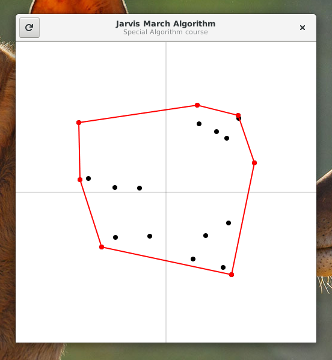

# Convexhull

## Calculates convexhull with Jarvis march

Convexhull is a presentation program for a jarvis march implementation. It
is written in C and utilizes GTK as presentation layer.

## Official Installation Instructions

You can install and test Convexhull:

    git clone https://github.com/gwutz/convexhull.git
    cd convexhull
    mkdir build && cd build
    meson ..
    ninja

then you can start Convexhull

    ./src/jarvis-march
